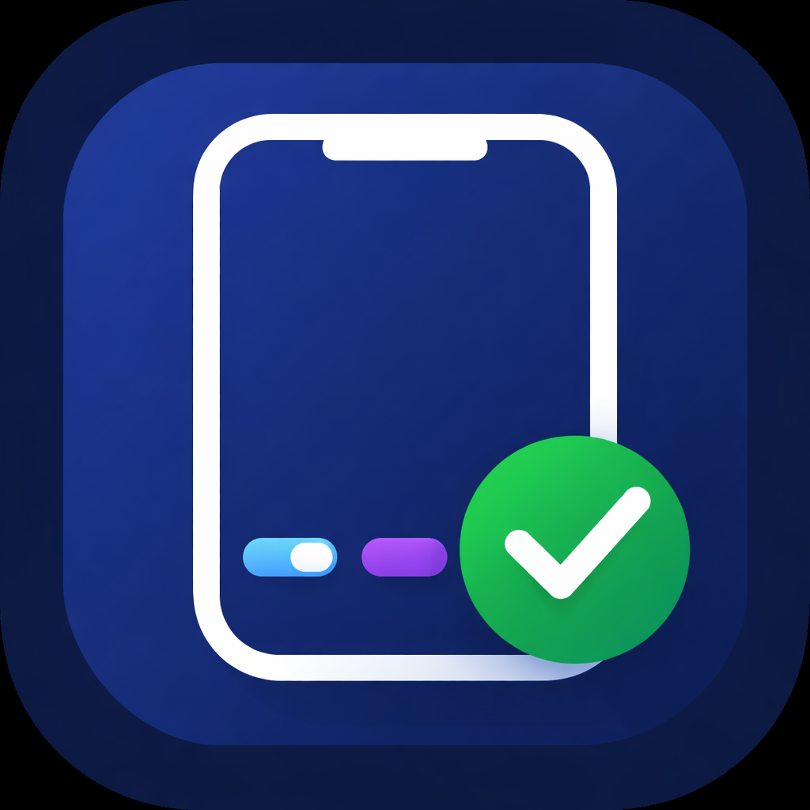
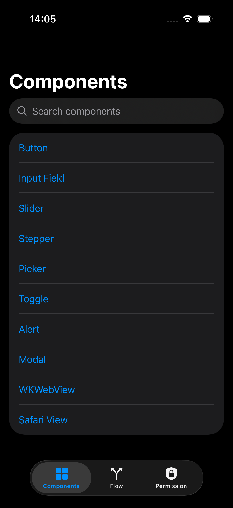
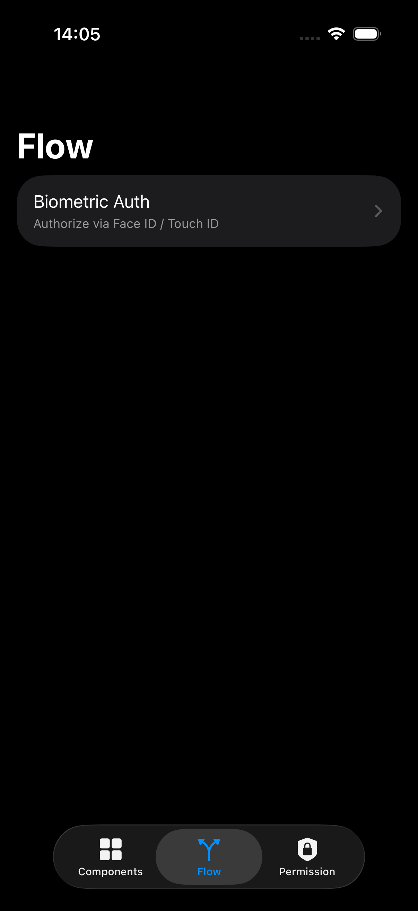
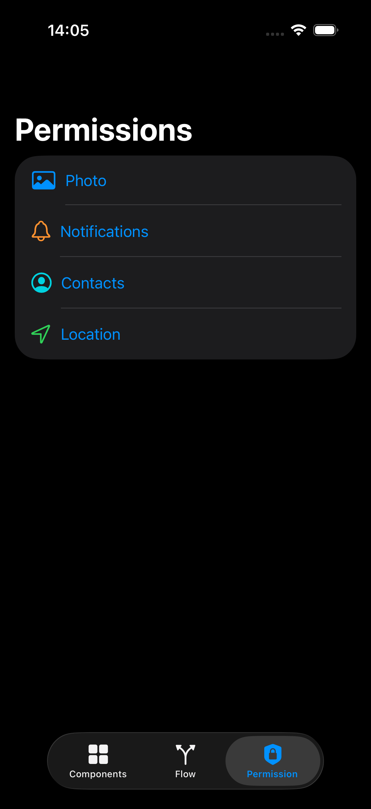

# XCUIPlayground

A SwiftUI-based iOS playground for learning and practicing UI testing with [XCUIAutomation](https://developer.apple.com/documentation/xcuiautomation).

XCUIPlayground is a focused sandbox for building reliable UI tests against realistic app behavior.  
It includes deterministic screens and common product flows so you can prototype selectors, synchronization logic, and end-to-end test scenarios with less flakiness.

## Features
- SwiftUI + MVVM architecture optimized for UI testing
- Deterministic UI states for reproducible tests
- Core component playground:
  - Buttons, inputs, toggles, sliders, steppers, pickers
  - Alerts, modals, web view, safari view
- Scenario playground:
  - Login flow
  - Biometric auth flow
  - Async loading and error handling states
- iOS permission playground:
  - Location
  - Photos
  - Contacts
  - Notifications
- Localization-ready setup (`en` and `ru`)

## Screenshots

| Components | Scenarios | Permissions |
| --- | --- | --- |
|  |  |  |

## Getting Started

1. Open `XCUIPlayground.xcodeproj` in Xcode.
2. Select an iOS Simulator target.
3. Build and run the app.
4. Start writing XCUI tests against stable, isolated flows.

## Project Structure

- `XCUIPlayground/Features/Components` - UI components for interaction testing
- `XCUIPlayground/Features/Scenarios` - end-to-end user flow scenarios
- `XCUIPlayground/Features/Permissions` - system permission related flows
- `XCUIPlayground/Resources/Localization` - localized resources and string catalog

## Who This Is For

- QA engineers improving iOS UI automation coverage
- iOS engineers validating testability of SwiftUI screens
- Teams creating onboarding exercises for UI automation

## Contributing

Contributions are welcome.  
Please open an issue for discussion before submitting major changes.

## License

This project is released under the [MIT License](LICENSE).
